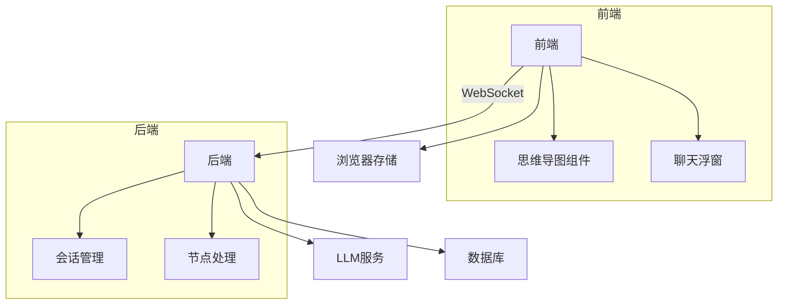

# 思维导图聊天工具技术架构

## 1. 系统概览


## 2. 核心功能模块

### 2.1 交互式思维导图
- **技术选型**: Vue 3 + D3.js 或 GoJS
- 功能特性：
  - 可拖拽/缩放画布
  - 节点CRUD操作
  - 节点标记(@引用)功能
  - 确认生成按钮

### 2.2 聊天交互
- **技术选型**: WebSocket + ChatUI组件库
- 工作流程：
  1. 用户输入问题
  2. 标记导图节点(可选)
  3. LLM生成回复
  4. 用户确认后生成节点

### 2.3 数据持久化
- **本地存储**: IndexedDB (聊天记录+临时导图)
- **云端存储**: 
  - 导图数据: MongoDB (文档存储)
  - 聊天记录: PostgreSQL (关系型)

## 3. 数据模型

### 3.1 思维导图节点
```typescript
interface MindNode {
  id: string;
  content: string;
  parentId?: string;
  children: string[];
  createdAt: Date;
  updatedAt: Date;
  chatRefs: string[]; // 关联的聊天记录ID
}
```

### 3.2 聊天消息
```typescript
interface ChatMessage {
  id: string;
  sessionId: string;
  role: 'user' | 'assistant';
  content: string;
  referencedNode?: string; // 引用的节点ID
  createdAt: Date;
}
```

## 4. API设计

### 4.1 导图服务
| 端点 | 方法 | 描述 |
|------|------|------|
| `/api/maps` | POST | 创建新导图 |
| `/api/maps/:id` | GET | 获取导图 |
| `/api/maps/:id/nodes` | POST | 添加节点 |

### 4.2 聊天服务
| 端点 | 方法 | 描述 |
|------|------|------|
| `/api/chat/ws` | WS | WebSocket连接 |
| `/api/chat/sessions` | GET | 获取历史会话 |

## 5. 技术栈推荐

### 前端
- 框架: Vue 3 + TypeScript
- 状态管理: Pinia
- 可视化: GoJS/Vue-Flow
- UI组件: Element Plus

### 后端
- 运行时: Python 3.10+
- 框架: FastAPI
- ORM: SQLAlchemy
- LLM集成: LangGraph
- 异步处理: Celery

### 部署
- 容器化: Docker
- CI/CD: GitHub Actions
- 监控: Sentry + Prometheus
